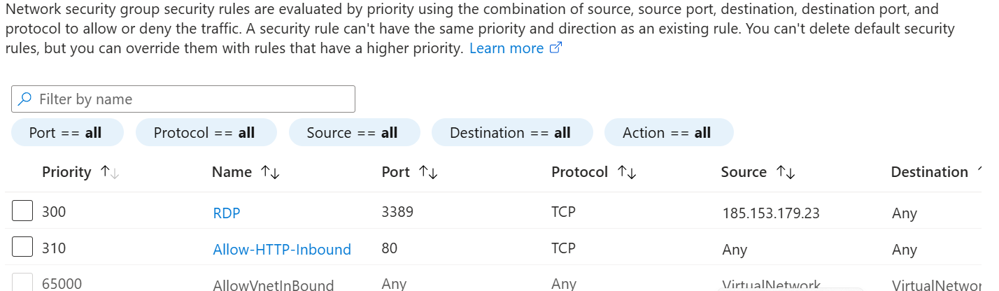

# Phase 12: Network Hardening (NSG Configuration)

### **Objective**
To implement a "Least Privilege" network security model for the MediSecure infrastructure, ensuring only validated traffic can reach the YYC-Dispatcher-VM.

### **Technical Execution**
* **Inbound Audit:** Reviewed existing Network Security Group (NSG) rules to identify potential attack vectors.
* **Traffic Segmentation:** Configured a new inbound rule to allow standard web traffic (Port 80) for the dispatcher portal.
* **Management Security:** Verified that Remote Desktop (RDP) access is strictly limited to an authorized administrative IP address, preventing brute-force attempts from the public internet.

---

### **Visual Evidence: Inbound Security Rules**
The following configuration demonstrates a secured perimeter with a "Deny-by-Default" stance.

---

### **Security Impact**
By narrowing the "Source" of management traffic and explicitly defining allowed service ports, we have significantly reduced the virtual machine's attack surface while maintaining service availability for healthcare dispatchers.
